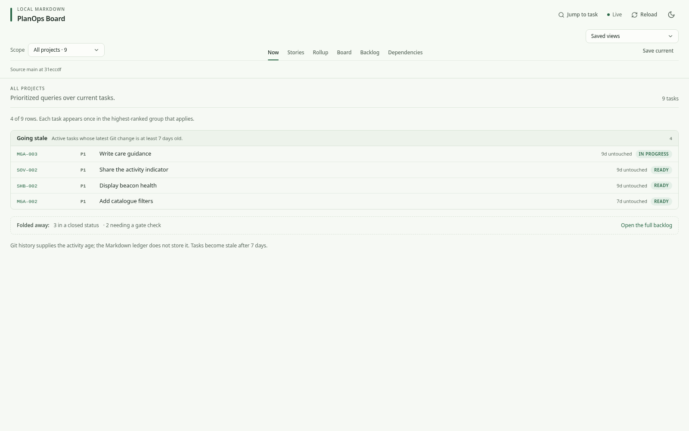

# PlanOps Board

PlanOps Board is a local web app for managing Markdown task ledgers in a Git
repository. It reads configured Markdown files, applies guarded edits, and can
create explicit local commits. It never pulls or pushes.



## Quick start

Requires Node.js 24 or newer and Git.

```bash
git clone https://github.com/alex-macra/planops-board.git
cd planops-board
npm ci

demo_dir=$(mktemp -d)
npm run demo:init -- "$demo_dir/repo"
npm run dev -- --repo "$demo_dir/repo"
```

Open `http://127.0.0.1:5176`. The demo initializer creates a disposable Git
repository with fictional plans and commit history.

## Use your repository

Pass any local Git repository with a PlanOps Board configuration:

```bash
npm run dev -- --repo /path/to/planning-repository
```

The default configuration path is `.projects-board/config.json` inside the
selected repository. Start from the bundled template:

```bash
mkdir -p /path/to/planning-repository/.projects-board
cp -n examples/planops-config.json /path/to/planning-repository/.projects-board/config.json
```

Update the document patterns to match your Markdown layout. See the
[configuration schema](schema/config.schema.json) and the
[fictional demo](examples/demo-repo) for complete examples.

Task tables require `ID` and `Status` columns. Optional columns add priorities,
dependencies, owners, and richer views. The configured project map is optional.

Available commands:

```bash
npm run dev -- --repo <path>
npm run build
npm run start -- --repo <path>
```

Both app commands accept `--config <repository-relative-path>` and `--port <number>`. The optional
`.projects-board/validate` hook is enabled only with `--allow-external-validator`.

## Safety

- The server binds only to `127.0.0.1`.
- Document writes are limited to configured Markdown files inside the Git root.
- Writes use conflict guards, locking, atomic replacement, validation, and exact rollback.
- Commits refuse configured protected branches and stage only discovered documents.
- The app never pulls, pushes, or calls a repository hosting API.

Do not expose the server to a network or open an untrusted repository.

## Development

```bash
npm run verify
npm run test:e2e -- --project=chromium
npm run test:lighthouse
npm audit --audit-level=high
```

Tests that write use disposable copies of the fictional demo. See
[CONTRIBUTING.md](CONTRIBUTING.md) and [SECURITY.md](SECURITY.md).

## License

[MIT](LICENSE)
