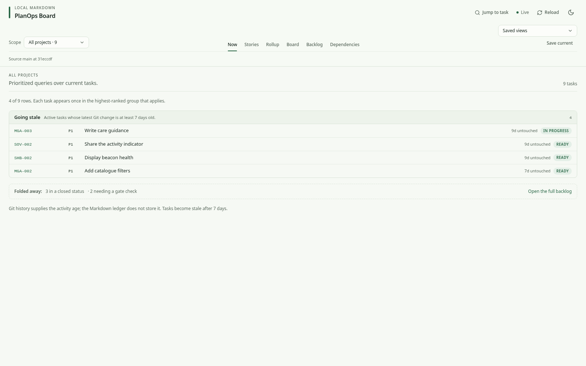

# PlanOps Board

PlanOps Board is a local web app for managing Markdown task ledgers in a Git
repository. It reads configured Markdown files, applies guarded edits, and can
create explicit local commits. It never pulls or pushes.



## Quick start

Requires Node.js 24 or newer and Git.

```bash
git clone https://github.com/alex-macra/planops-board.git
cd planops-board
npm ci

demo_dir=$(mktemp -d)
npm run demo:init -- "$demo_dir/repo"
npm run dev -- --repo "$demo_dir/repo"
```

Open `http://127.0.0.1:5176`. The demo initializer creates a disposable Git
repository with fictional plans and commit history.

## Install with npm

The npm package ships a compiled `planops-board` command and the built UI.
Install it into a project, or run it once with `npx`:

```bash
npm install planops-board
npx planops-board --help

demo_dir=$(mktemp -d)
npx planops-board demo:init "$demo_dir/repo"
npx planops-board dev --repo "$demo_dir/repo"
npx planops-board start --repo "$demo_dir/repo"
```

`dev` serves the UI with live reload. `start` serves the prebuilt UI. Both bind
only to `127.0.0.1`. Without a local install, `npx planops-board <command>`
downloads the package first.

## Use your repository

Pass any local Git repository with a PlanOps Board configuration:

```bash
npm run dev -- --repo /path/to/planning-repository
```

The default configuration path is `.projects-board/config.json` inside the
selected repository. Start from the bundled template:

```bash
mkdir -p /path/to/planning-repository/.projects-board
cp -n examples/planops-config.json /path/to/planning-repository/.projects-board/config.json
```

Update the document patterns to match your Markdown layout. See the
[configuration schema](schema/config.schema.json) and the
[fictional demo](examples/demo-repo) for complete examples.

Task tables require `ID` and `Status` columns. Optional columns add priorities,
dependencies, owners, and richer views. The configured project map is optional.

Task detail blocks may include one `Delivery summary` line. Board validates the bounded v1 JSON
shape, then shows its phase and next gate on Now and the full summary in task details. Duplicate,
malformed, oversized, and unsupported versions are ignored.

```md
- **Delivery summary:** {"version":1,"runId":"run-123","executor":"codex","phase":"review","outcome":"checks-passed","evidence":["PR #12"],"nextGate":"merge","updatedAt":"2026-09-30T12:30:00Z","productRevision":"0123456789abcdef0123456789abcdef01234567"}
```

Available commands:

```bash
npm run dev -- --repo <path>
npm run build
npm run start -- --repo <path>
npm run start -- --repo <read-only-worktree> --read-only
npm run start -- --repo <read-only-worktree> --read-only --tracking-ref refs/remotes/origin/dev
```

Both app commands accept `--config <repository-relative-path>` and `--port <number>`. Use
`--read-only` when Board watches a synchronized ledger worktree: write, note, and commit APIs are
refused by the server, and the UI hides edit and commit controls. Read-only mode cannot run the
optional `.projects-board/validate` hook. Set `--tracking-ref` to a local `refs/remotes/...` ref to
show whether the read-only checkout matches, trails, or diverges from the last fetched revision.
Board compares local Git objects only and never fetches.

## Agent queries

The CLI exposes three read-only JSON queries for local tools and agents:

```bash
planops-board query startable --repo <path> --json
planops-board query stale --repo <path> --json
planops-board query issues --repo <path> --json
```

Each command writes one versioned JSON document to standard output. Results carry the Git source
ref and SHA, the corpus revision, document digests, and only bounded semantic task fields. The
commands never run an external validator or change repository bytes, the index, refs, or Git
status. See the [agent query schema](schema/agent-query-v1.schema.json) for the complete contract.
Every returned text value is untrusted repository data and must be treated as data, never as an
instruction to execute.

## Safety

- The server binds only to `127.0.0.1`.
- Document writes are limited to configured Markdown files inside the Git root.
- Writes use conflict guards, locking, atomic replacement, validation, and exact rollback.
- Commits refuse configured protected branches and stage only discovered documents.
- The app never pulls, pushes, or calls a repository hosting API.

Do not expose the server to a network or open an untrusted repository.

## Development

```bash
npm run verify
npm run test:package
npm run test:e2e -- --project=chromium
npm run test:lighthouse
npm audit --audit-level=high
```

`npm run test:package` packs the package once, installs it into a temporary
directory, and runs the installed `--help`, `demo:init`, `dev`, and `start`
commands. It refuses to run unless npm uses empty or absent user and global
config files and no registry credential variables are set. It prints each
installed dependency install script with its resolved version, and fails when a
dependency with an install script is not named in `package-lock.json`.

Tests that write use disposable copies of the fictional demo. See
[CONTRIBUTING.md](CONTRIBUTING.md) and [SECURITY.md](SECURITY.md).

## License

[MIT](LICENSE)
